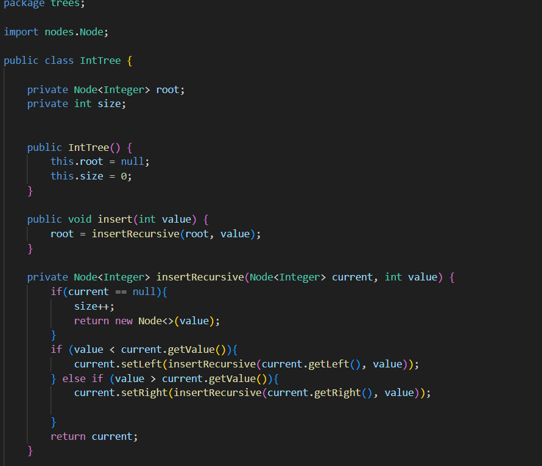
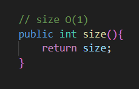
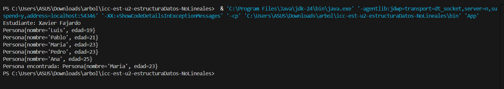
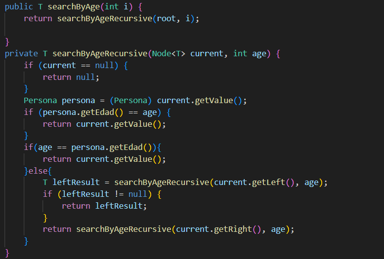

# Práctica: Estructuras No Lineales - 

## Autor
- Nombre: [Xavier Fajardo]
- Carrera/Curso: [Estrucutra de Datos]

##  Nombre de la práctica - Fecha
- Práctica: [Práctica de Árboles – Implementación Integers]
- Fecha: [2026-01-05]

## Descripción
Implemente los metodos preorden, posorden, inorden ademas del metodo int size bajar la complejidad del size a O(1)

## Evidencias
### Captura 1
Inserta aquí la captura del código o de la ejecución.
- Archivo: `assets/captura-1.png`!

Lo que se muestra hay son los recorridos que se vieron en clase pero ahora se implemento en codigo y el tamaño del arbol que nos muestra el metodo size

### Captura 2 
Inserta aquí una segunda captura si aplica.
- Archivo: `assets/captura-2.png`
 
 
 
- Se optimizó el tamaño del árbol usando un contador que se actualiza al insertar nodos, evitando una mayor complejidad al aumentar en espacial
# Práctica: Estructuras No Lineales - 

## Autor
- Nombre: [Xavier Fajardo]
- Carrera/Curso: [Estrucutura de Datos]

##  Nombre de la práctica - Fecha
- Práctica: [Práctica de Árboles – Implementación Genéricos uso de interfaces Comparable]
- Fecha: [2026-01-06]

## Descripción
Se tranajo en un arbol binario con clases genricas donde usamos una persona donde le implementamos un comparador y ademas inclimos un busuqeda binaria para encontrar una persona de edad 23 

## Evidencias
### Captura 1
Inserta aquí la captura del código o de la ejecución.
- Archivo: 

### Captura 2 
Inserta aquí una segunda captura si aplica.
- Archivo: 